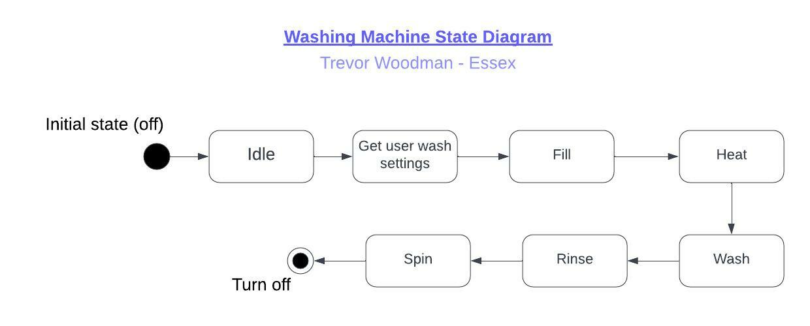
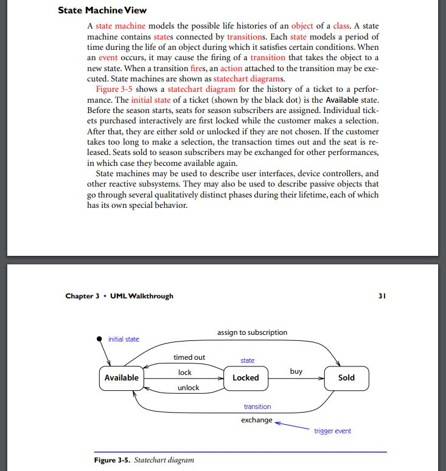
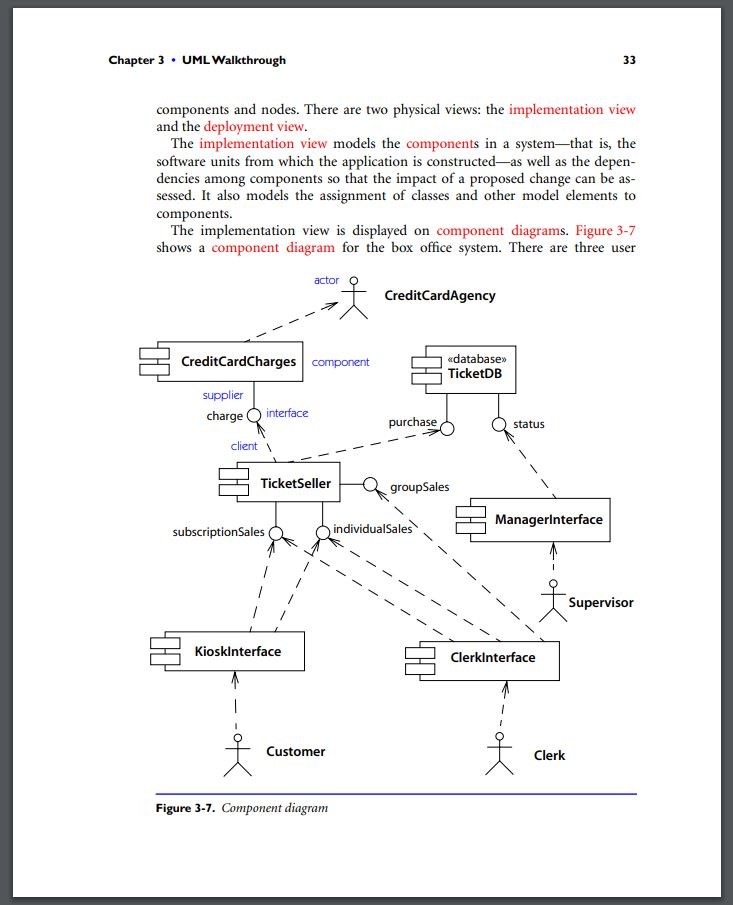

## Module 2: Assignment 3: Unit 3

### Table of Contents

- 🖼️[Washing Machine State Diagram](#washing-machine-state-diagram)
- 📷[UML Reference Manual Screenshots](#uml-reference-manual-screenshots)

### Requirements

This activity is as follows:

- Discuss which UML models are most applicable at different stages of the Software Development Life Cycle.
  - **_I've skipped this, but I suppose the washing machine state diagram counts as an artefact_**
- Making reference to ‘The Unified Modeling Language Reference Manual Second Edition’, use the State Machine Diagram in Figure 3-7 to design a similar model for a washing machine.
  - **_The referenced figure, Figure 3-7, is in fact not a state machine diagram, it is a component diagram, so I suspect that this was a typo. Figure 3-5 is a state machine diagram, so I will be using that as a basis instead. I've included an excerpt of pages 48-51 from the book [here](#uml-reference-manual-screenshots) to prove that. I've included my state machine diagram, "washing-machine-state-diagram.jpeg" in this folder, and below. Obviously it is a very basic implementation of a state machine, perhaps there are more than one rinse cycles, spin cycles, etc, but it shows the basis of what a washing machine state machine would look like._**

### Washing Machine State Diagram

### UML Reference Manual Screenshots

#### UML Reference Manual Figure 3-5

#### UML Reference Manual Figure 3-7

