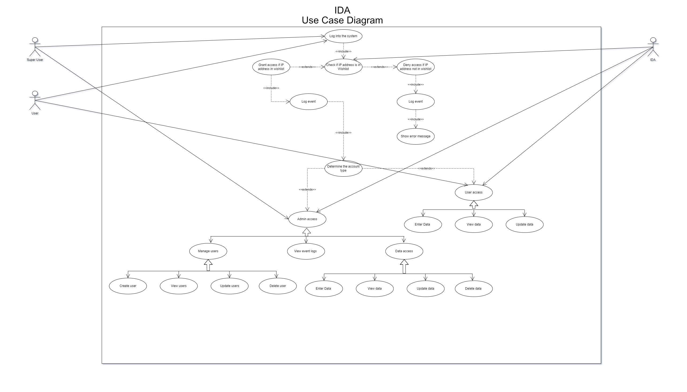
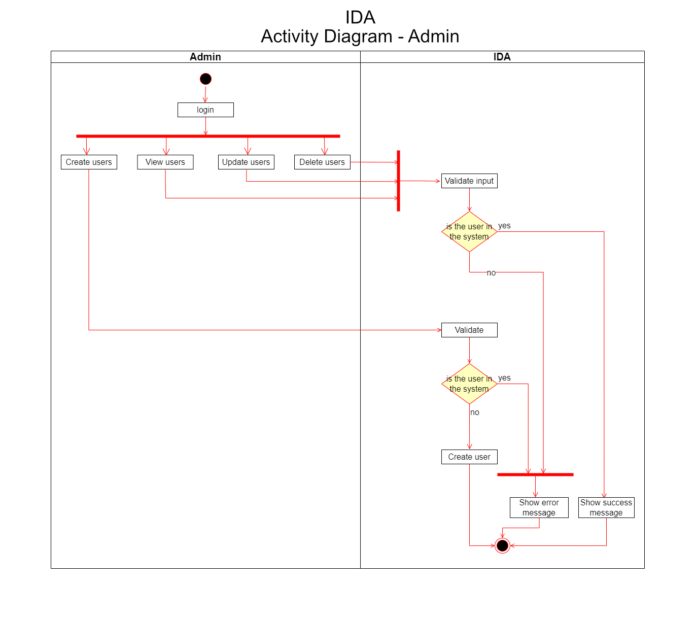
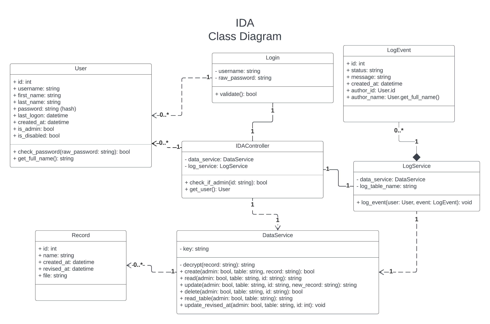

⬅️[Back](/pages/module3/assignment1/m3a1.html)

[https://github.com/turbits/essex-eportfolio](https://github.com/turbits/essex-eportfolio)  - [https://essex.trevorwoodman.ca](https://essex.trevorwoodman.ca)

# ISS Data Archive (IDA) Software Design Document

Secure Software Development - Assignment 1: Secure Repository Team Design Document

University of Essex Online

## Team Transparency Members

Abassi, Daud A., Adams, Uthman., Calder, Dheeran., Woodman, Trevor

## Domain

The International Space Station (ISS) is the product of a multi-national construction project of the largest structure humans have ever built in space. The ISS is in low-earth orbit and, on average, hosts an international crew of seven people (NASA, 2023). The estimated daily average of mission-related data handled on the Space Network is approximately 28TB per day (Jacobson & Hume, 2017).

## Objective

To facilitate and securely store the constant stream of mission data coming from the ISS, the programme has contracted Team Transparency to develop and deploy a software system that will provide a secure repository for data transmitted from the International Space Station to ground stations owned and operated by members of the ISS programme. This system has been given the moniker “IDA”, ISS Data Archive.

## Assumptions

This document assumes the highest standard of both physical and cyber security. Ground stations should be physically secured, e.g., security personnel and systems should be used in conjunction with strict personnel identity verification. Any networks and systems at the ground stations should be secured, hardened, and maintained.

## User Roles

User:

- Can read the data
- Can update the data

Admin:

- In addition to User permissions:
  - Can delete the data
  - Can view the event logs
  - Can manage users

## Software Specification

Mission-related data is encrypted prior to being transported via the Space Network down to a base station, where it is decrypted and stored on-site for later user access.

The IDA prototype is comprised of Bottle running the backend & web server and HTML & CSS presenting a simple GUI. The data is stored in a SQLite database and communicated with via the Bottle backend.

The DataService microservice processes the data stream, decrypts incoming ISS data with the cryptography Python library using Fernet symmetric cryptography and stores the data in the local SQLite database. It also responds to requests made via a REST API.

The basic HTML & CSS frontend comprises three distinct interfaces: a login portal, a table viewer, and an admin dashboard showing users and event logs. Users must authenticate through the login to access the directory. All authorised and authenticated users can create and read data via this interface. Superusers can also update and delete data via this interface, manage users via the admin dashboard, and view event logs.

An event logging microservice processes all events and keeps a separate table accessible by privileged users; event logs are immutable.

## Software Design

### Frontend

- All authorised users can authenticate against a web interface to access the data interface
- Privileged users can delete data via the main interface
- Privileged users have access to two additional pages: admin to manage users and event logs
- The frontend will be minimal and responsive, using raw HTML and CSS; function over form

### Backend

- A simple REST API will be created to facilitate CRUD operations and user authentication
- User input will be sanitised server-side to protect against injection-based attacks
- All actions will be logged and are immutable, even by superusers

## System Requirements

The system is platform-agnostic; it is compatible with any platform that can run Python 3.11.2.

Specific resource requirements would vary depending on the amount of data being processed by the DataService, and how many users are requesting data from the database at a given time.

The following are baseline resource requirements, but heavier usage may require more resources:

- 2GHz or faster multi-core processor
- 4GB of system memory
- 50GB of free storage space

## Quality Assurance and Testing

### Usability

IDA from a user perspective is intuitive and minimalistic. The UI will only contain a few interfaces.

### Maintainability

The code is well formed and commented where necessary. Functions, variables, classes, models, and other items and objects are clearly named, and their purpose is easily understood.

### Scalability

The IDA prototype is built using Python 3.11 and SQLite and uses very few libraries. The web server and database can be swapped out for more robust options.

### Reliability

Testing and error-checking will help with reliability of IDA; as will focusing on simplicity of the microservices and the API for user-run operations.

### Portability

IDA is platform-agnostic and can be set up to run anywhere Python 3.11 will run.

## Security Concerns and Mitigation

### Privacy and GDPR

Personal information used is limited to first name, last name, and username. These data points would have been collected and a privacy policy signed as part of employment by one of the members of the ISS programme.

Under GDPR, these data points would fall under one or more of the following articles: Article 6(1)(a) through Article 6(1)(f) (GDPR.EU, no date).

### OWASP Top Ten

| Item                                                | Mitigation                                                                                                                                          |
| --------------------------------------------------- | --------------------------------------------------------------------------------------------------------------------------------------------------- |
| A01:2021 Broken Access Control                      | Guarded by user authorisation via the API, as SQLIte does not support access control.                                                               |
| A02:2021 Cryptographic Failures                     | Data that is sent by the ISS and consumed by IDA use Fernet symmetric cryptography                                                                  |
| A03:2021 Injection                                  | User input is sanitised client side and again server-side by the DataService                                                                        |
| A04:2021 Insecure Design                            | The simplicity of the application and limited attack surface (local access) assist in making IDA secure by design.                                  |
| A05:2021 Security Misconfiguration                  | The .env file contains secrets and configuration and is never committed to a public folder. Secure standards are used for configuration.            |
| A06:2021 Vulnerable and Outdated Components         | Uses modern and tested frameworks, libraries, and cryptographic standards.                                                                          |
| A07:2021 Identification and Authentication Failures | Users and events are managed and tracked; Login could be extended to check for low-effort and common passwords. Passwords are hashed using hashlib. |
| A08:2021 Software and Data Integrity Failures       | Python memory zeroing is unreliable, which is a potential issue but would require server access to exploit.                                         |
| A09:2021 Security Logging and Monitoring Failures   | Immutable event logs are taken for every action.                                                                                                    |
| A10:2021 Server-Side Request Forgery                | CRUD and file operations require proper authorisation and authentication.                                                                           |

### Tools and Libraries

| Item               | Version                                                                                                                                          |
| ------------------ | ------------------------------------------------------------------------------------------------------------------------------------------------ |
| Language           | Python 3.11.2                                                                                                                                    |
| Framework          | Bottle 0.12.15                                                                                                                                   |
| IDEs               | Visual Studio Code                                                                                                                               |
| Libraries          | hashlib, cryptography 39.0.2                                                                                                                     |
| Database           | SQLite 3                                                                                                                                         |
| Platforms          | Platform-agnostic, runs wherever Python 3.11 runs                                                                                                |
| Other Technologies | pip 22.3.1 (python package installer), virtualenv 20.19.0 (virtual Python environment), pipenv 2023.2.18 (virtual Python environment management) |

## Software Diagrams

## References

- NASA (2023) International Space Station Facts and Figures. Available at: [https://www.nasa.gov/feature/facts-and-figures](https://www.nasa.gov/feature/facts-and-figures) [Accessed 16 February 2023]
- Jacobson, A. & Hume, A. (2017) NASA Communications Network to Double Space Station Data Rates. Available at: [https://www.nasa.gov/feature/goddard/2016/nasa-communications-network-to-double-space-station-data-rates](https://www.nasa.gov/feature/goddard/2016/nasa-communications-network-to-double-space-station-data-rates) [Accessed 16 February 2023]
- GDPR.EU (no date) General Data Protection Regulation (GDPR). Available at: [https://gdpr.eu/article-6-how-to-process-personal-data-legally/](https://gdpr.eu/article-6-how-to-process-personal-data-legally/) [Accessed 23 February 2023]
