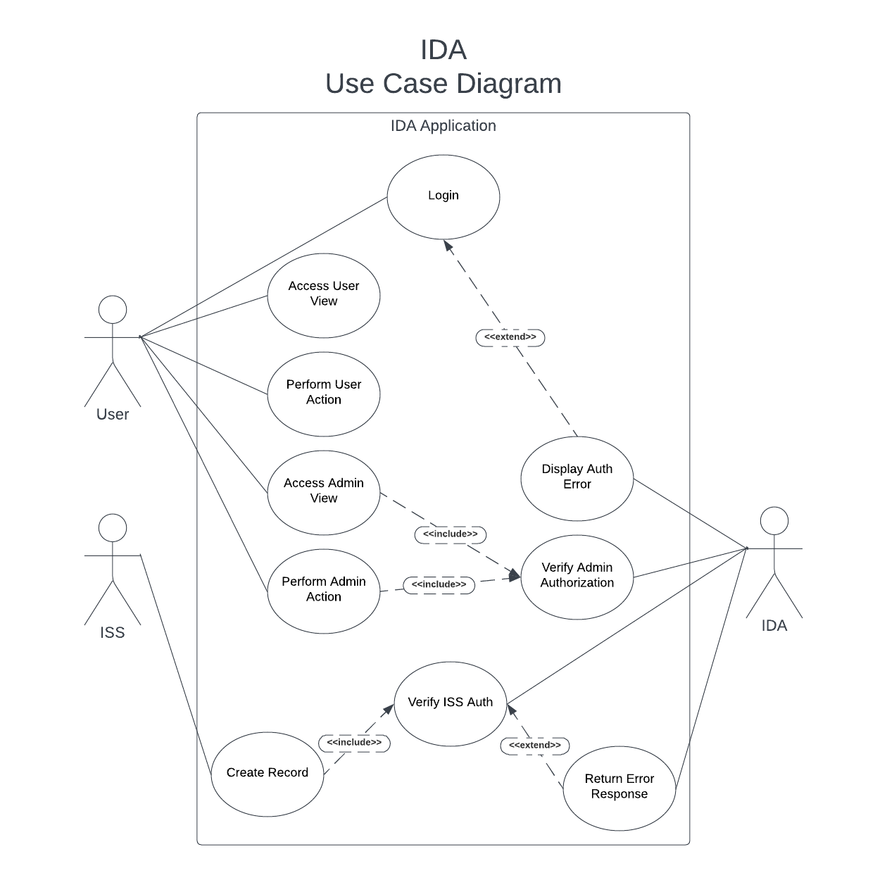
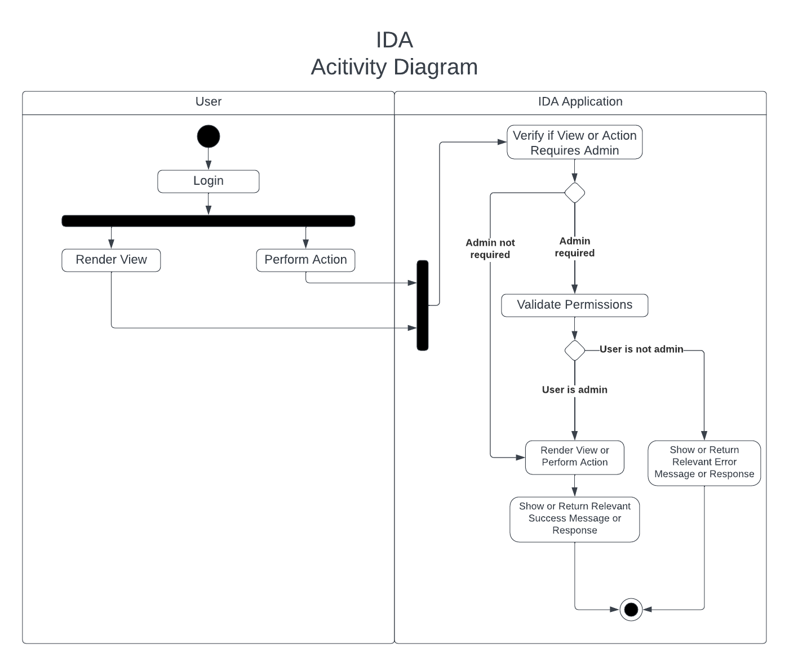
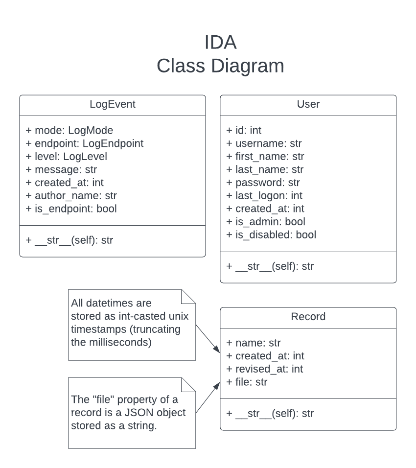

⬅️[Back](/pages/module3.html)

## Module 3: Assignment 2: Coding Output: Updated Design Document

## ISS Data Archive (IDA) Software Design Document

Secure Software Development - Secure Repository Design Document

University of Essex Online

### Team Transparency Members

Abassi, Daud A., Adams, Uthman., Calder, Dheeran., Woodman, Trevor

### Domain

The International Space Station (ISS) is the product of a multi-national project of the largest structure humans have ever built in space. The ISS is in low-earth orbit and, on average, hosts an international crew of seven people (NASA, 2023). The estimated average of mission-related data handled on the Space Network is approximately 28TB daily (Jacobson & Hume, 2017).

### Objective

To facilitate and securely store mission data coming from the ISS, the programme has contracted Team Transparency to develop a prototype for a system that will provide a secure repository for data transmitted from the ISS to ground stations owned and operated by members of the ISS programme. This system has been given the moniker “IDA”, ISS Data Archive.

### Assumptions

This document assumes the highest standard of both physical and cyber security. Ground stations are physically secured, e.g., personnel and systems are used in conjunction with strict identity verification. Networks and systems at the ground stations are secured, hardened, and maintained.

### User Roles

User:

- Can read records
- Can update records

Admin:

- In addition to User permissions:
  - Can delete records and users
  - Can edit users
  - Can view the event logs

### Software Specification

Mission-related data is encrypted using Fernet encryption and a shared key prior to being transported via the Space Network down to a base station, where it is decrypted by IDA and stored on-site.

The IDA prototype is comprised of Flask running the backend and web server and a simple GUI frontend using HTML and CSS. The data is stored in a SQLite database and communicated with via a bespoke API written using Flask.

The ISS microservice crafts random "record" objects to be then sent to the “/records” endpoint on IDA at a given interval. The endpoint processes the data stream, decrypts the incoming ISS data using Fernet symmetric encryption with a known shared key between the ISS and the IDA system, and stores the data in the local SQLite database.

The frontend comprises a handful of interfaces: home, login, records, users, and logs. Users must authenticate to access the application. All authenticated users can create and read data via this interface. Admins can also edit and delete records and users and view the event logs.

Event logging is threaded, processing all events and keeping a separate table that is viewable by admins only. Event logs are meant to be immutable and there exists no endpoints or functions to modify or delete logs. This is not a full immutable solution, as the database could still be manually modified or deleted.

### Software Design

#### Frontend

- Users can authenticate against a web interface to access the application
- Admins can edit and delete records and users via the interface
- Admins have access to two secured views: users and logs
- The frontend is minimal and responsive, using HTML, CSS, and minimal JS

#### Backend

- A bespoke and robust REST API facilitates backend operations
- User input is validated and sanitised server-side to protect against injection-based attacks
- All actions will be logged and are immutable, even by admins

### System Requirements

The system is platform-agnostic; it is compatible with any platform that can run Python 3.11.

Resource requirements vary on the amount of data being processed by the application, and how many users are requesting data from the database at a time.

These are baseline requirements, with heavier usage requiring more resources:
- 2GHz or faster multi-core processor
- 2GB of RAM
- 10GB of storage

### Quality Assurance and Testing

#### Usability

IDA from a user perspective is intuitive and minimalistic. The UI contains few interfaces.

#### Maintainability

The code is well formed and commented where necessary. Functions, variables, classes, models, and other items and objects are clearly named, and their purpose is easily understood.

#### Scalability

The IDA prototype is built using Python 3.11 and SQLite and uses few libraries. The libraries in use are tested and proven. The web server and database can be swapped out for more robust options.

#### Reliability

Testing and robust error-checking will help with reliability of IDA; as will focusing on simplicity of the microservices and the API.

#### Portability

IDA is platform-agnostic and can be set up to run anywhere Python 3.11 will run.

### Security Concerns and Mitigation

#### Privacy and GDPR

Personal information used is limited to first name, last name, and username. These data points would have been collected and a privacy policy signed as part of employment by the ISS programme.

Under GDPR, these data points would fall under one or more of the following articles: Article 6(1)(a) through Article 6(1)(f) (GDPR.EU, no date).

#### OWASP Top Ten

| Item                                                | Mitigation                                                                                                                                          |
| --------------------------------------------------- | --------------------------------------------------------------------------------------------------------------------------------------------------- |
| A01:2021 Broken Access Control                      | Guarded by user authorisation via the API. SQLite does not support access control.                                                               |
| A02:2021 Cryptographic Failures                     | Data that is sent by the ISS and consumed by IDA uses Fernet symmetric cryptography.                                                                  |
| A03:2021 Injection                                  | User input is sanitised client and server-side.                                                                        |
| A04:2021 Insecure Design                            | The simplicity of the application, security-first approach, and limited attack surface (local access) assists in making IDA secure by design.                                  |
| A05:2021 Security Misconfiguration                  | The .env file contains secrets and configuration and is never committed to public folders (the prototype does, for ease of use). Secure standards are used for configuration.            |
| A06:2021 Vulnerable and Outdated Components         | Uses modern and tested frameworks, libraries, and cryptographic standards.                                                                          |
| A07:2021 Identification and Authentication Failures | Sessions are managed and tracked; Login could be extended to check for low-complexity and common passwords. Passwords are stored and used in plaintext in the prototype, but should be encrypted in production. |
| A08:2021 Software and Data Integrity Failures       | Python memory zeroing is unreliable, a potential security issue but would require server access to exploit.                                         |
| A09:2021 Security Logging and Monitoring Failures   | Immutable event logs are taken for every action.                                                                                                    |
| A10:2021 Server-Side Request Forgery                | All operations require proper authorisation and authentication.                                                                           |

#### Tools and Libraries

| Item               | Version                                                                                                                                          |
| ------------------ | ------------------------------------------------------------------------------------------------------------------------------------------------ |
| Language           | Python 3.11.2                                                                                                                                    |
| Framework          | Flask 2.2.3                                                                                                                                   |
| IDEs               | Visual Studio Code                                                                                                                               |
| Libraries          | cryptography 39.0.2                                                                                                                     |
| Database           | SQLite 3                                                                                                                                         |
| Platforms          | Platform-agnostic, runs wherever Python 3.11 runs                                                                                                |
| Other Technologies | pip 22.3.1 (python package installer), requests 2.28.2 ("Python HTTP for Humans"), virtualenv 20.19.0 (virtual Python environment) |

### Software Diagrams

### References

- NASA (2023) International Space Station Facts and Figures. Available at: [https://www.nasa.gov/feature/facts-and-figures](https://www.nasa.gov/feature/facts-and-figures) [Accessed 16 February 2023]
- Jacobson, A. & Hume, A. (2017) NASA Communications Network to Double Space Station Data Rates. Available at: [https://www.nasa.gov/feature/goddard/2016/nasa-communications-network-to-double-space-station-data-rates](https://www.nasa.gov/feature/goddard/2016/nasa-communications-network-to-double-space-station-data-rates) [Accessed 16 February 2023]
- GDPR.EU (no date) General Data Protection Regulation (GDPR). Available at: [https://gdpr.eu/article-6-how-to-process-personal-data-legally/](https://gdpr.eu/article-6-how-to-process-personal-data-legally/) [Accessed 23 February 2023]
