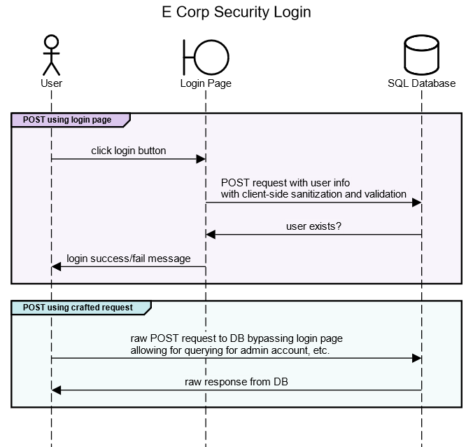

⬅️[Back](/pages/module3/unit-assignments/unit1/m3u1.html)

## Module 3: Unit 1: Initial Post

> ### Initial Post - Security Misconfiguration
>
> #### by Trevor Woodman - Wednesday, 1 February 2023, 8:39 PM
>
> I have created a sequence diagram using Sequence Diagram that shows the login process behind an external-facing login page for E Corp, and the process for a POST request bypassing the login page. Successfully authenticating leads to an internal GUI that allows the user to look up physical and electronic security and audit logs from a SQL database, primarily used by E Corp’s contracted security company.
>
> The login page appears to be secure; it uses HTTPS and has a valid certificate signed by a trusted authority. The login page elements have client-side sanitation and validation. Upon further inspection, a bad actor finds out that the server-side sanitation and validation is not implemented, and they are receiving responses directly from the SQL database. Being trivial to defeat client-side validation, the bad actor easily finds with crafted requests that the database is misconfigured, and the default administrator account is still active. Another query and they find that the default password has not been changed.
>
> Through the misconfiguration of the SQL database, the bad actor has easily gained control of the SQL database and of the internal GUI via the default administrative credentials.
>
> The flowchart provided shows login process and how it queries the SQL database. We can clearly see that, through misconfiguration, a bad actor could defeat client-side sanitization and validation and abuse the misconfigured SQL database.

### Sequence Diagram (Text)

This markup language is used by: [https://sequencediagram.org](https://sequencediagram.org)

```
title E Corp Security Login

actor User
boundary Login Page
database SQL Database

# POST req to DB using login page
group #dbc7ed POST using login page
User->Login Page:click login button
Login Page->SQL Database:POST request with user info\nwith client-side sanitization and validation
SQL Database->Login Page:user exists?
Login Page->User:login success/fail message
end

# POST req to DB using crafted request
group #c7e9ed POST using crafted request
User->SQL Database:crafted POST request to DB bypassing login page\nallowing for querying for admin account, etc.
SQL Database->User:raw response from DB
end
```

### Sequence Diagram (Image)


