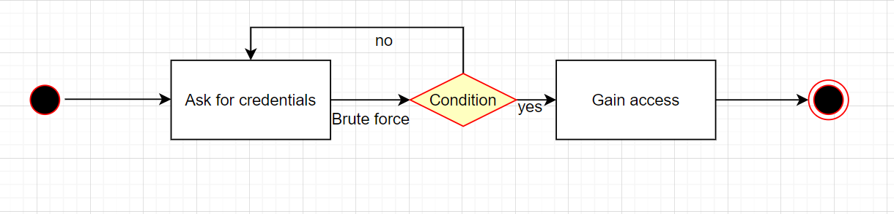

⬅️[Back](/pages/module3/unit-assignments/unit1/m3u1.html)

# Module 3: Unit 1: Peer Response 1

This is a unit assignment component of [Secure Software Development](/pages/module3.html) - [Unit 1](/pages/module3/unit-assignments/unit1/m3u1.html).

- 📃[Image Version](/pages/module3/unit-assignments/unit1/peer-response-1/m3u1p1.html)

### Uthman Adams' Initial Post

> #### Initial Post - Broken Authentication
>
> ##### by Uthman Adams - Thursday, 2 February 2023, 11:16 AM
>
> One of the top 10 vulnerabilities as identified by OWASP, is broken authentication (OWASP, 2021). A significant security risk might arise from improperly implemented authentication and session management calls. These flaws could make it simple for attackers to assume the identities of authorized users.
>
> Due to users being careless with their passwords or using weak passwords, it makes it easier for hackers to get into their accounts and gain access to personal information. Enforcing strong password regulations and extra security measures, such as two-factor authentication (2FA) or one-time passwords (OTP), that ensure user compliance can help to reduce this.
>
> An activity diagram demonstrating how a hacker can access a user's account is provided below. Since there is no 2FA in place, the attacker has the freedom to attempt as many passwords as they like, beginning with a weaker one. It will be more difficult to log in with complex passwords, a restriction on the number of times an incorrect password can be entered, and 2FA in place.
>
> 
>
> Reference
>
> OWASP (2021). OWASP Top 10 - 2021. Available from: https://owasp.org/Top10/ [Accessed 1 February 2023].

### My Peer Response

> #### Peer Response
>
> ##### by Trevor Woodman - Thursday, 2 February 2023, 6:08 PM
>
> Hi Uthman,
>
> Your post and flowchart were easy to follow. It's easy to assume that users will choose passwords that are difficult to guess or brute force, and 2FA is a solid means of defence against it. I believe you may have forgotten to add the condition to the condition symbol, but one can still easily infer the meaning. Your circle symbols are actually connector symbols, generally used to indicate a connection to another part of the flowchart, but I believe in this case ovals should be used. Ovals are terminators and indicate a start or an end to a process.
>
> You may also think about MFA, which can get quite complex! MFA is commonly used interchangeably with 2FA, but are dissimilar in that MFA incorporates a minimum of two but typically more than two factors of authentication. For example, a login page requests your username or email, your password, and an MFA code. You have your credentials (username or email and password) which is called "something you know" in MFA terms, your device to generate the code (something you have), and the MFA code itself (something you have). Possession factors are slightly convoluted in that a fingerprint or face unlock requirement on a phone would technically count as another factor, "something the user is". But the login page, given no other factors, would be a minimum of 3 in this case.
>
> Thank you for your post Uthman
