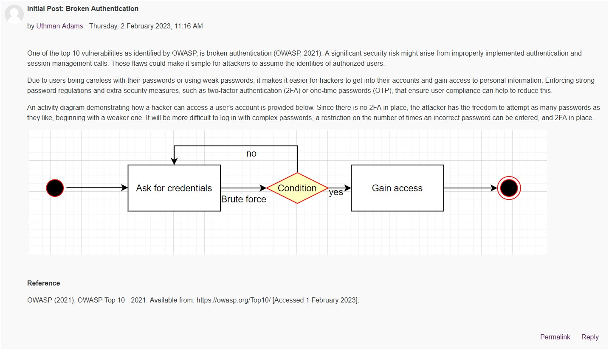
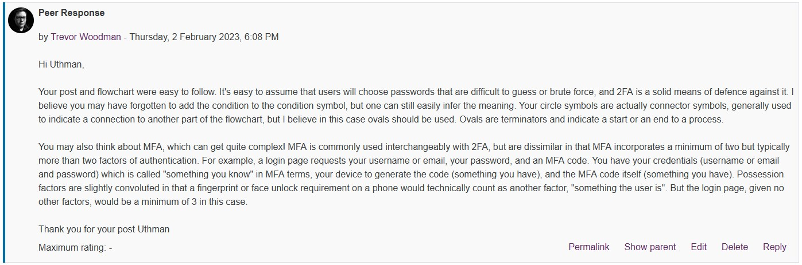

⬅️[Back](/pages/module3/unit-assignments/unit1/m3u1.html)

# Module 3: Unit 1: Peer Response 1

This is a unit assignment component of [Secure Software Development](/pages/module3.html) - [Unit 1](/pages/module3/unit-assignments/unit1/m3u1.html).

- 📃[Text Version](/pages/module3/unit-assignments/unit1/peer-response-1/m3u1p1-txt.md)

### Uthman Adams' Initial Post

### My Peer Response

