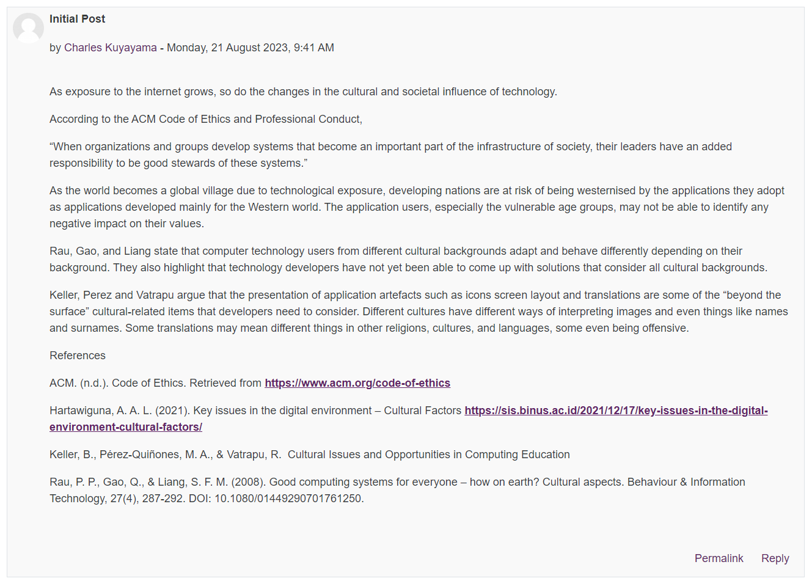

⬅️[Back](/pages/module5/unit-assignments/unit2/m5u2.html)

# Unit 2 Collaborative Discussion - Week 2

## Instructions

>Continue with the Unit 1 Discussion forum. Considering what you have now learned in both units, you should respond to at least two of your peers’ contributions from Unit 1. Please try to limit your posts to 200-300 words maximum, so that others may be encouraged to reflect on, and respond to your ideas.
>Your follow-up responses should be labelled as 'Peer Response'.
>For guidance, look at the guidelines for the peer review process on the Department’s homepage. This provides an excellent way to understand and constructively feedback on other peoples’ points of view.
>Some reading to help you with your responses can be found in the Bott (2018) Unit 2 Reading depending on the scenario you have chosen.

## Peer Response 1

### Ahmad, Hamad - Initial Post

### Woodman, Trevor - Peer Response 1

__*Text Version*__

Thank you for your insightful post Hamad. You bring up a good point where you say "...make their operations legally permissible but ethically questionable." - I considered the lack of legislation as more of a legally grey area rather than strictly permissible, but you are technically correct. Their actions were certainly ethically questionable, and arguable totally unethical. Rogue put private interest above public interest, and conducted themselves in a manner that indicated that they either did not consider the impact of their actions on the public, or that they determined their actions were acceptable.

Your following statement, referenced from Tavani, H.T., "legality does not always equate to ethicality" (Tavani, 2012) is also an intriguing point. I believe I agree with this statement, but in my opinion, I would also argue that the reverse is true. Laws differ by country and ethics can be quite subjective, depending on the situation. Considering ones actions and the balance of them against the perceived positives can be a difficult task, and I believe that laws are in place to, generally, assist one in this balancing act. Your conclusion that the actions of the computing professionals involved made an unethical decision differs from mine, for example. I have also noticed that you appear to contradict yourself here, when stating that computing professionals "have a duty to maintain integrity and competence" but then stating that their actions were "considered unlawful"; I would argue that your initial point of "legality does not always equate to ethicality" applies here. To me, they were acting in the public interest, they showed professional competence and integrity (well crafted, purpose-built malware to minimize collateral damage), they partnered with relevant authorities to ensure their actions were considered lawful, and through these previous actions proved their duty to their profession by considering the ethical and legal aspects of their actions (BCS, n.d.).

__*References*__

- British Computing Society (n.d.). BCS Code of Conduct. Available at: https://www.bcs.org/membership-and-registrations/become-a-member/bcs-code-of-conduct/ [Accessed 31 August 2023]

- Tavani, H.T., (2012). Ethics and Technology: Controversies, Questions, and Strategies for Ethical Computing, 4th Edition. Available at: https://dl.acm.org/doi/abs/10.5555/2490723 [Accessed 31 August 2023]

---

## Peer Response 2

### Kuyayama, Charles - Initial Post

### Woodman, Trevor - Peer Response 2

__*Text Version*__

Hi Charles, thank you for your post. Your post sheds light on a crucial aspect of technological advancement- its cultural and societal influence. The ACM Code of Ethics and Professional Conduct emphasizes the responsibility of organizations in shaping the systems that become integral to society's infrastructure. Your concern on westernization is thought-provoking; it's true that the globalization facilitated by technology can lead to the homogenization of cultures.

The point made by Rau, et al., regarding the influence of cultural backgrounds on technology adoption and behaviour (Rau, et al., 2008) is an interesting point that I had not considered previously. Acknowledging that one size doesn't fit all is crucial for developers, and the notion that technology should be culturally sensitive and adaptable holds merit. Technology and software developers should consider the cultural implications of their work, and the impact it may have on the society that adopts it.

I had also not considered that icons and screen layout would play a part in the impact on cultures and values. Often, seemingly minor aspects like how icons, layouts, and translations would appear to someone from another culture are overlooked or considered as an afterthought. The potential for misinterpretation or misunderstanding is high, and the impact of these aspects should be considered throughout the development lifecycle.

You raise good points in your post, and I have learned of the importance of technology advancement and thorough consideration of how it will impact a people or culture. Unfortunately, you appear to be missing the case study component of the activity chosen from ACM's case studies list (ACM, n.d.), I would have enjoyed reading your take on one as you have brought up good points here. I would also suggest providing in-line citations for your references so the reader can easily identify the sources of your information and research.

__*References*__

- Association for Computing Machinery (n.d.). ACM Code of Ethics and Professional Conduct. Available at: https://www.acm.org/code-of-ethics/case-studies [Accessed 31 August 2023]
- Rau, P.P., et al. (2008). Good computing systems for everyone - how on earth? Cultural aspects. Available at: https://www.tandfonline.com/doi/abs/10.1080/01449290701761250 [Accessed 31 August 2023]
