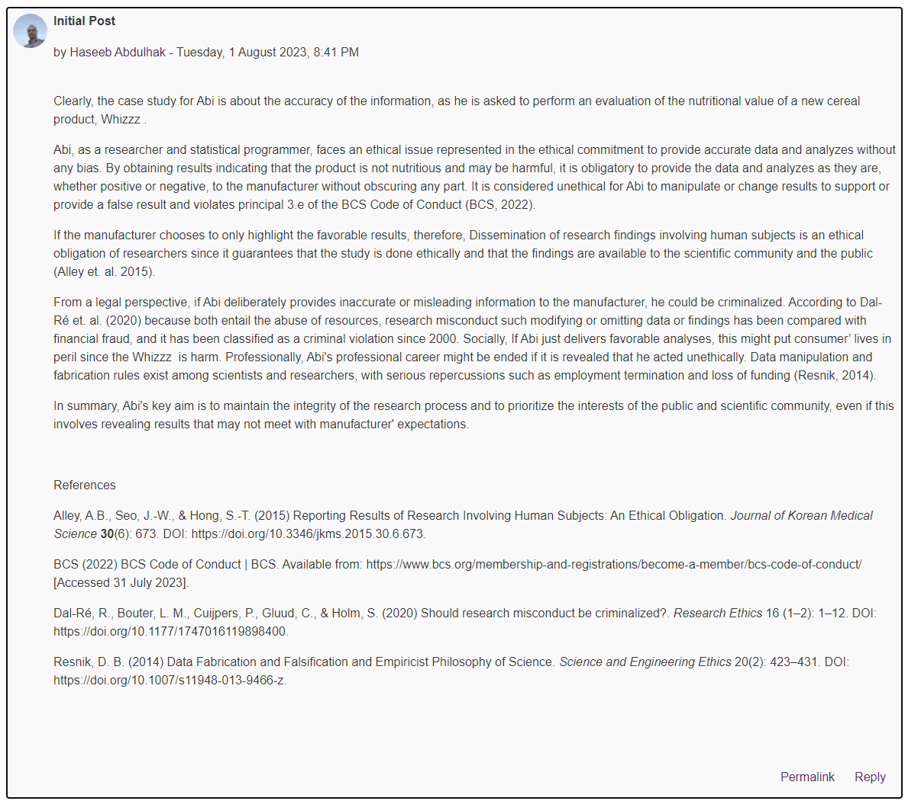
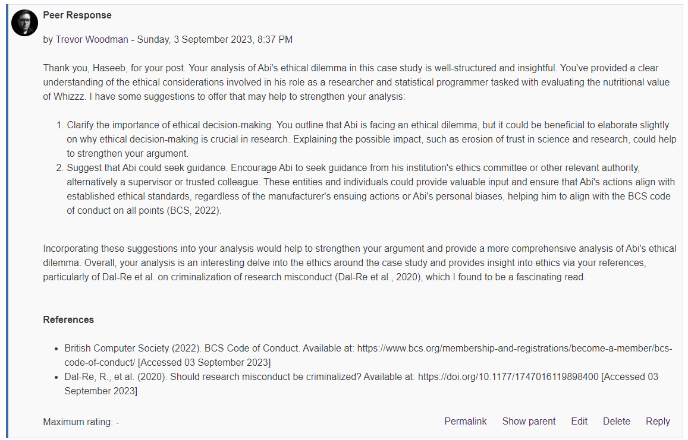
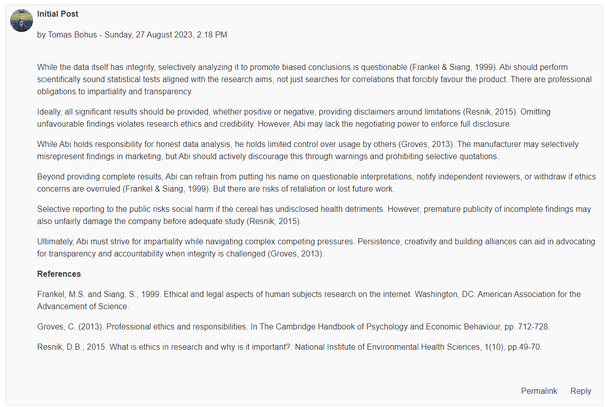
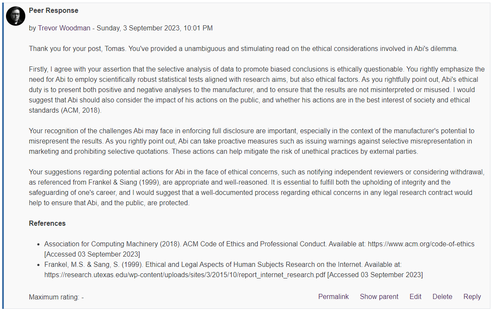
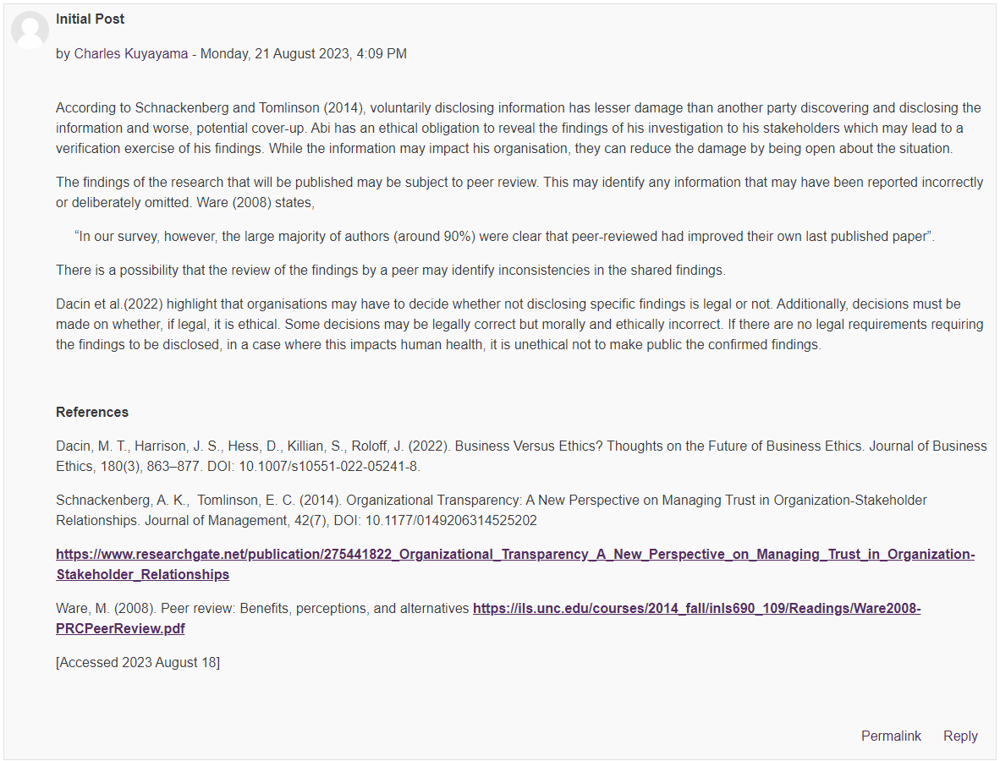
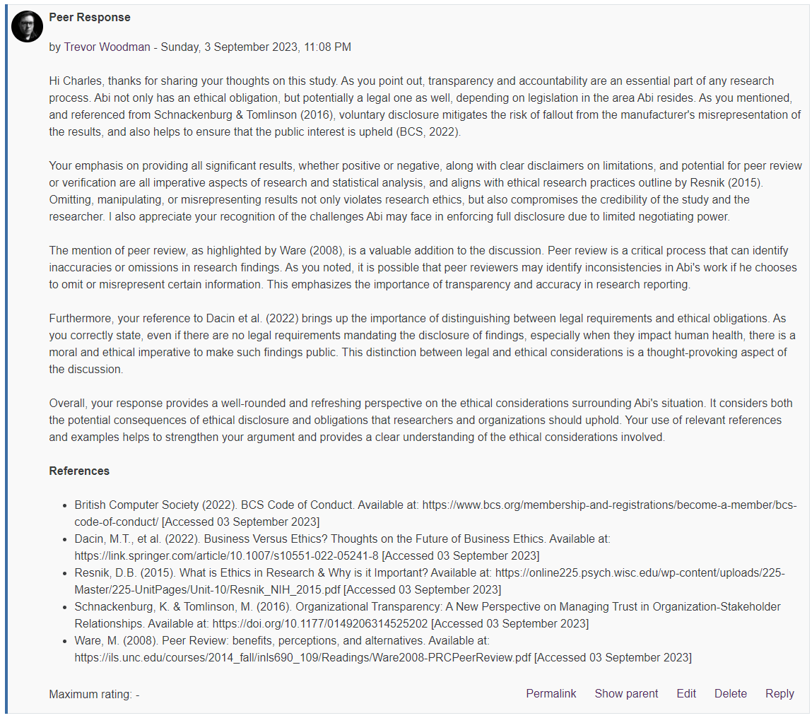

⬅️[Back](/pages/module5/unit-assignments/unit8/m5u8.html)

# Unit 8 Collaborative Discussion 2 - Week 2

## Instructions

>Continue with the Unit 7 Discussion forum. Considering what you have now learned in both units, you should respond to at least three of your peers’ contributions from Unit 7.
>Please try to limit your posts to 200-300 words maximum, so that others may be encouraged to reflect on, and respond to your ideas.
>Your follow-up responses should be labelled as 'Peer Response'.
>For guidance, look at the guidelines for the peer review process on the Department’s homepage. This provides an excellent way to understand and constructively feedback on other peoples’ points of view.

## Peer Response 1

### Abdulhak, Haseeb - Initial Post

### Woodman, Trevor - Peer Response 1

__*Text Version*__

Thank you, Haseeb, for your post. Your analysis of Abi's ethical dilemma in this case study is well-structured and insightful. You've provided a clear understanding of the ethical considerations involved in his role as a researcher and statistical programmer tasked with evaluating the nutritional value of Whizzz. I have some suggestions to offer that may help to strengthen your analysis:

1. Clarify the importance of ethical decision-making. You outline that Abi is facing an ethical dilemma, but it could be beneficial to elaborate slightly on why ethical decision-making is crucial in research. Explaining the possible impact, such as erosion of trust in science and research, could help to strengthen your argument.

2. Suggest that Abi could seek guidance. Encourage Abi to seek guidance from his institution's ethics committee or other relevant authority, alternatively a supervisor or trusted colleague. These entities and individuals could provide valuable input and ensure that Abi's actions align with established ethical standards, regardless of the manufacturer's ensuing actions or Abi's personal biases, helping him to align with the BCS code of conduct on all points (BCS, 2022).

Incorporating these suggestions into your analysis would help to strengthen your argument and provide a more comprehensive analysis of Abi's ethical dilemma. Overall, your analysis is an interesting delve into the ethics around the case study and provides insight into ethics via your references, particularly of Dal-Re et al. on criminalization of research misconduct (Dal-Re et al., 2020), which I found to be a fascinating read.

__*References*__

- British Computer Society (2022). BCS Code of Conduct. Available at: https://www.bcs.org/membership-and-registrations/become-a-member/bcs-code-of-conduct/ [Accessed 03 September 2023]
- Dal-Re, R., et al. (2020). Should research misconduct be criminalized? Available at: https://doi.org/10.1177/1747016119898400 [Accessed 03 September 2023]

---

## Peer Response 2

### Bohus, Tomas - Initial Post

### Woodman, Trevor - Peer Response 2

__*Text Version*__

Thank you for your post, Tomas. You've provided a unambiguous and stimulating read on the ethical considerations involved in Abi's dilemma.

Firstly, I agree with your assertion that the selective analysis of data to promote biased conclusions is ethically questionable. You rightly emphasize the need for Abi to employ scientifically robust statistical tests aligned with research aims, but also ethical factors. As you rightfully point out, Abi's ethical duty is to present both positive and negative analyses to the manufacturer, and to ensure that the results are not misinterpreted or misused. I would suggest that Abi should also consider the impact of his actions on the public, and whether his actions are in the best interest of society and ethical standards (ACM, 2018).

Your recognition of the challenges Abi may face in enforcing full disclosure are important, especially in the context of the manufacturer's potential to misrepresent the results. As you rightly point out, Abi can take proactive measures such as issuing warnings against selective misrepresentation in marketing and prohibiting selective quotations. These actions can help mitigate the risk of unethical practices by external parties.

Your suggestions regarding potential actions for Abi in the face of ethical concerns, such as notifying independent reviewers or considering withdrawal, as referenced from Frankel & Siang (1999), are appropriate and well-reasoned. It is essential to fulfill both the upholding of integrity and the safeguarding of one's career, and I would suggest that a well-documented process regarding ethical concerns in any legal research contract would help to ensure that Abi, and the public, are protected.

__*References*__

- Association for Computing Machinery (2018). ACM Code of Ethics and Professional Conduct. Available at: https://www.acm.org/code-of-ethics [Accessed 03 September 2023]
- Frankel, M.S. & Sang, S. (1999). Ethical and Legal Aspects of Human Subjects Research on the Internet. Available at: https://research.utexas.edu/wp-content/uploads/sites/3/2015/10/report_internet_research.pdf [Accessed 03 September 2023]

---

## Peer Response 3

### Kuyayama, Charles - Initial Post

### Woodman, Trevor - Peer Response 3

__*Text Version*__

Hi Charles, thanks for sharing your thoughts on this study. As you point out, transparency and accountability are an essential part of any research process. Abi not only has an ethical obligation, but potentially a legal one as well, depending on legislation in the area Abi resides. As you mentioned, and referenced from Schnackenburg & Tomlinson (2016), voluntary disclosure mitigates the risk of fallout from the manufacturer's misrepresentation of the results, and also helps to ensure that the public interest is upheld (BCS, 2022).

Your emphasis on providing all significant results, whether positive or negative, along with clear disclaimers on limitations, and potential for peer review or verification are all imperative aspects of research and statistical analysis, and aligns with ethical research practices outline by Resnik (2015). Omitting, manipulating, or misrepresenting results not only violates research ethics, but also compromises the credibility of the study and the researcher. I also appreciate your recognition of the challenges Abi may face in enforcing full disclosure due to limited negotiating power.

The mention of peer review, as highlighted by Ware (2008), is a valuable addition to the discussion. Peer review is a critical process that can identify inaccuracies or omissions in research findings. As you noted, it is possible that peer reviewers may identify inconsistencies in Abi's work if he chooses to omit or misrepresent certain information. This emphasizes the importance of transparency and accuracy in research reporting.

Furthermore, your reference to Dacin et al. (2022) brings up the importance of distinguishing between legal requirements and ethical obligations. As you correctly state, even if there are no legal requirements mandating the disclosure of findings, especially when they impact human health, there is a moral and ethical imperative to make such findings public. This distinction between legal and ethical considerations is a thought-provoking aspect of the discussion.

Overall, your response provides a well-rounded and refreshing perspective on the ethical considerations surrounding Abi's situation. It considers both the potential consequences of ethical disclosure and obligations that researchers and organizations should uphold. Your use of relevant references and examples helps to strengthen your argument and provides a clear understanding of the ethical considerations involved.

__*References*__

- British Computer Society (2022). BCS Code of Conduct. Available at: https://www.bcs.org/membership-and-registrations/become-a-member/bcs-code-of-conduct/ [Accessed 03 September 2023]
- Dacin, M.T., et al. (2022). Business Versus Ethics? Thoughts on the Future of Business Ethics. Available at: https://link.springer.com/article/10.1007/s10551-022-05241-8 [Accessed 03 September 2023]
- Resnik, D.B. (2015). What is Ethics in Research & Why is it Important? Available at: https://online225.psych.wisc.edu/wp-content/uploads/225-Master/225-UnitPages/Unit-10/Resnik_NIH_2015.pdf [Accessed 03 September 2023]
- Schnackenburg, K. & Tomlinson, M. (2016). Organizational Transparency: A New Perspective on Managing Trust in Organization-Stakeholder Relationships. Available at: https://doi.org/10.1177/0149206314525202 [Accessed 03 September 2023]
- Ware, M. (2008). Peer Review: benefits, perceptions, and alternatives. Available at: https://ils.unc.edu/courses/2014_fall/inls690_109/Readings/Ware2008-PRCPeerReview.pdf [Accessed 03 September 2023]
