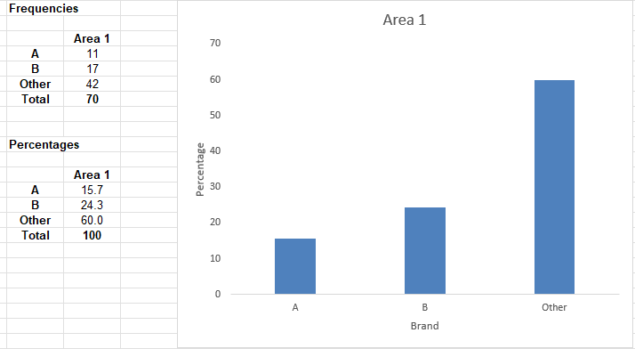
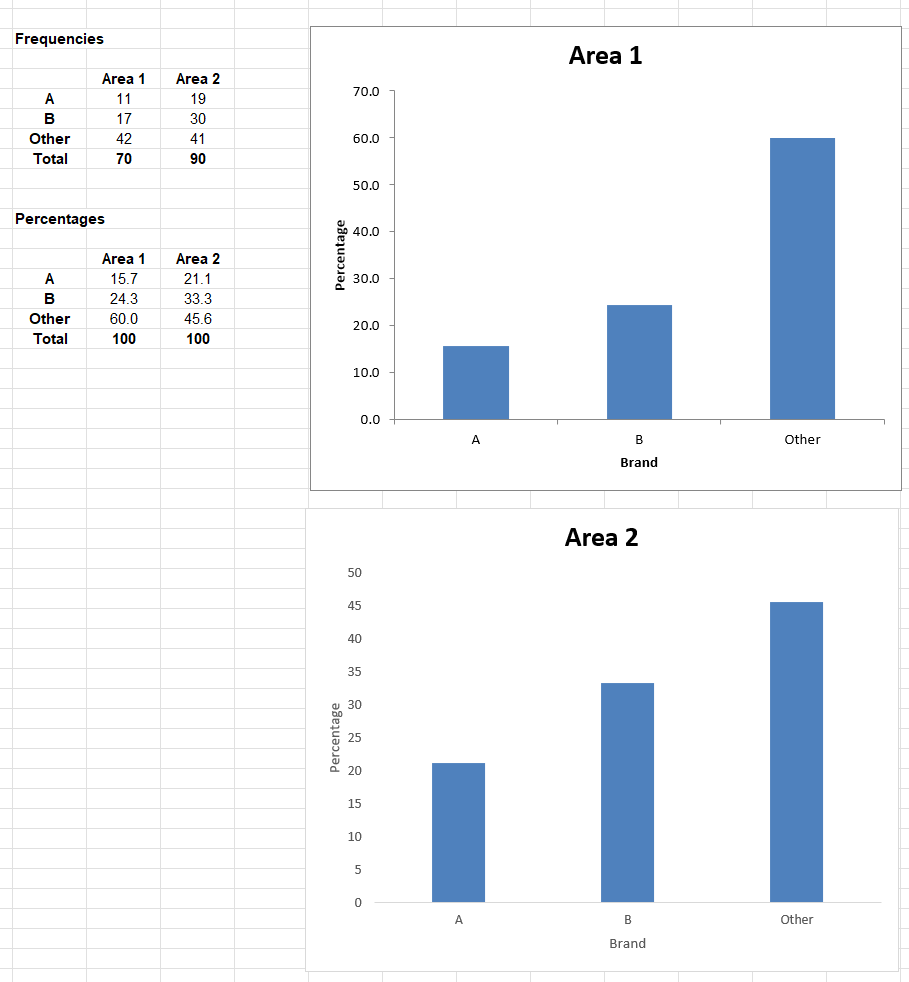
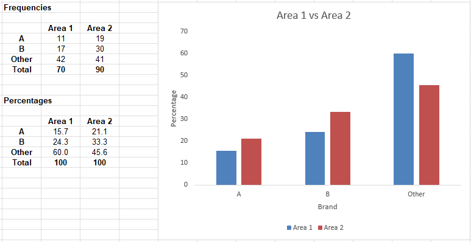
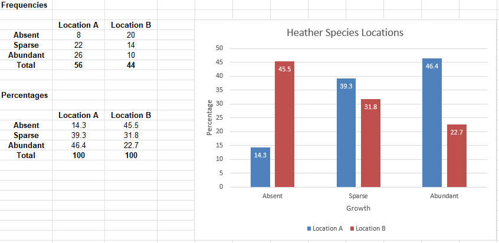
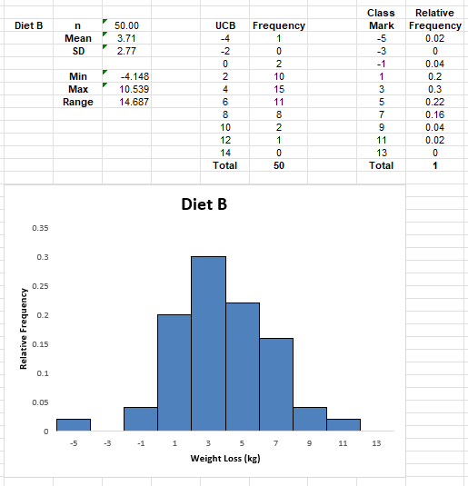

⬅️[Back](/pages/module5.html)

# Unit 9: Analyzing Qualitative Data

## Table of Contents

- 👉[Unit 9 Description](/pages/module5/unit-assignments/unit9/m5u9-description.html)
- 👉[Unit 9: Qualitative Data Worksheets](/pages/module5/unit-assignments/unit9/m5u9-worksheets.html)

## Worksheet Exercises

### Exercise 9.1

Example 9.1 chart:

Exercise 9.1 chart:

In the Area 2 bar chart, we can see that the overall sentiment is the same for these brands. The skew of preference is very similar to Area 1, with Brand A the least preferred, Brand B the second most preferred, and Brand Other taking the rest of the votes. There is a slightly smaller gap between Brand B and Brand Other in Area 2.

### Exercise 9.2

Example 9.2 chart:

Exercise 9.2 chart:

Because there was no mention of *not* including certain table settings; I prefer gridlines, legend, and numbers where appropriate as I prefer to have detail in my tables. Weirdly, the steps in the worksheet continuously called the horizontal lines "unsightly" in every exercise - I'm not sure how else one is supposed to gather important data at a glance (the point of a table) if there are no lines or indeed any information whatsoever in it, so I've included them.

From our chart, we can see that Location A has the largest growth of heather species, and Location B has significantly less heather, with nearly half the area absent. In contrast, nearly half of Location A is abundant with heather.

### Exercise 9.3

Example 9.3 chart:

Exercise 9.3 chart:

From our chart, we can see that Diet B had a larger range of weight loss, indicating that it is more variable than Diet A. From these results, we can conclude that Diet A appears to be more effective than Diet B, with Diet A having higher 3-5 kg loss and similar results elsewhere, with a 5kg gain being an outlier in Diet B.
