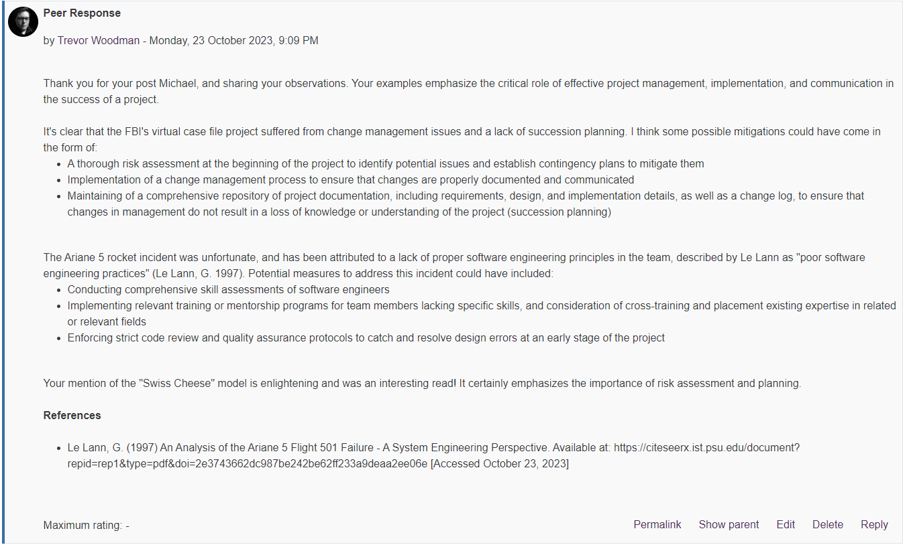

⬅️[Back](/pages/module6/unit-assignments/unit2/m6u2.html)

# Unit 2: Collaborative Discussion Responses

---

## Peer Response 1

### Peer Post - Tomas Mestanza

### My Response (Peer Response 1)

*Image Version*

*Text Version*

Thank you Tomas for your post. The example project failures you have provided are interesting. It's evident that the understanding of the root causes of the project failures here indicate a crucial need to understand the requirements of the project and to implement effective task and change management.

The Ariane 501 incident indeed failed from a lack of skills in the team, being attributed to "poor software engineering practices" (Le Lann, G. 1997). Possible mitigations of the incident could have been:
- Thorough skill assessments of software engineers
- Relevant training or mentorship programs for team members lacking specific skills, or cross-training and placement based on existing skillsets (for example, a software engineer with a background in mechanical engineering could be trained in the mechanical engineering aspects of the project, and vice versa)
- Rigorous code review and quality assurance processes to catch and rectify design errors early on in the project

BSkyB and the EDS CRM case is an interesting and costly one, ending in a 200 million GBP litigation win for BSkyB against EDS (Electronic Data Systems) for a failed customer relationship management system (Maughan, A., 2010). Some possible mitigations of this project failure could have been:
- Establishing clear communication channels and protocols to ensure that all team members are in agreement regarding project goals and expectations
- Regularly updating project timelines and milestones to keep stakeholders informed of the process
- Implementation of some form of iterative methodology, such as Agile or scrum, and perhaps additionally something like kanban, to ensure that the project is being managed in a way that can be easily understood by stakeholders, but most important iteratively worked upon and can be easily changed if necessary

In addition, it is important to conduct thorough risk assessments at the beginning of every project to identify potential issues and establish contingency plans to mitigate them. This, combined with a feedback loop of some kind, as well as a safe environment for team members to communicate and discuss issues and concerns, can help to mitigate project failures.

**References**

- Le Lann, G. (1997) An Analysis of the Ariane 5 Flight 501 Failure - A System Engineering Perspective. Available at: https://citeseerx.ist.psu.edu/document?repid=rep1&type=pdf&doi=2e3743662dc987be242be62ff233a9deaa2ee06e [Accessed October 23, 2023]
- Maughan, A. (2010) Analysis: the £200m BSkyB litigation win over HP EDS. Available at: https://www.cio.com/article/198415/analysis-the-200m-bskyb-litigation-win-over-hp-eds.html [Accessed October 23, 2023]

---

## Peer Response 2

### Peer Post - Michael Sammueller

### My Response (Peer Response 2)

*Image Version*

*Text Version*

Thank you for your post Michael, and sharing your observations. Your examples emphasize the critical role of effective project management, implementation, and communication in the success of a project.

It's clear that the FBI's virtual case file project suffered from change management issues and a lack of succession planning. I think some possible mitigations could have come in the form of:
- A thorough risk assessment at the beginning of the project to identify potential issues and establish contingency plans to mitigate them
- Implementation of a change management process to ensure that changes are properly documented and communicated
- Maintaining of a comprehensive repository of project documentation, including requirements, design, and implementation details, as well as a change log, to ensure that changes in management do not result in a loss of knowledge or understanding of the project (succession planning)

The Ariane 5 rocket incident was unfortunate, and has been attributed to a lack of proper software engineering principles in the team, described by Le Lann as "poor software engineering practices" (Le Lann, G. 1997). Potential measures to address this incident could have included:
- Conducting comprehensive skill assessments of software engineers
- Implementing relevant training or mentorship programs for team members lacking specific skills, and consideration of cross-training and placement existing expertise in related or relevant fields
- Enforcing strict code review and quality assurance protocols to catch and resolve design errors at an early stage of the project

Your mention of the "Swiss Cheese" model is enlightening and was an interesting read! It certainly emphasizes the importance of risk assessment and planning.

**References**

- Le Lann, G. (1997) An Analysis of the Ariane 5 Flight 501 Failure - A System Engineering Perspective. Available at: https://citeseerx.ist.psu.edu/document?repid=rep1&type=pdf&doi=2e3743662dc987be242be62ff233a9deaa2ee06e [Accessed October 23, 2023]
