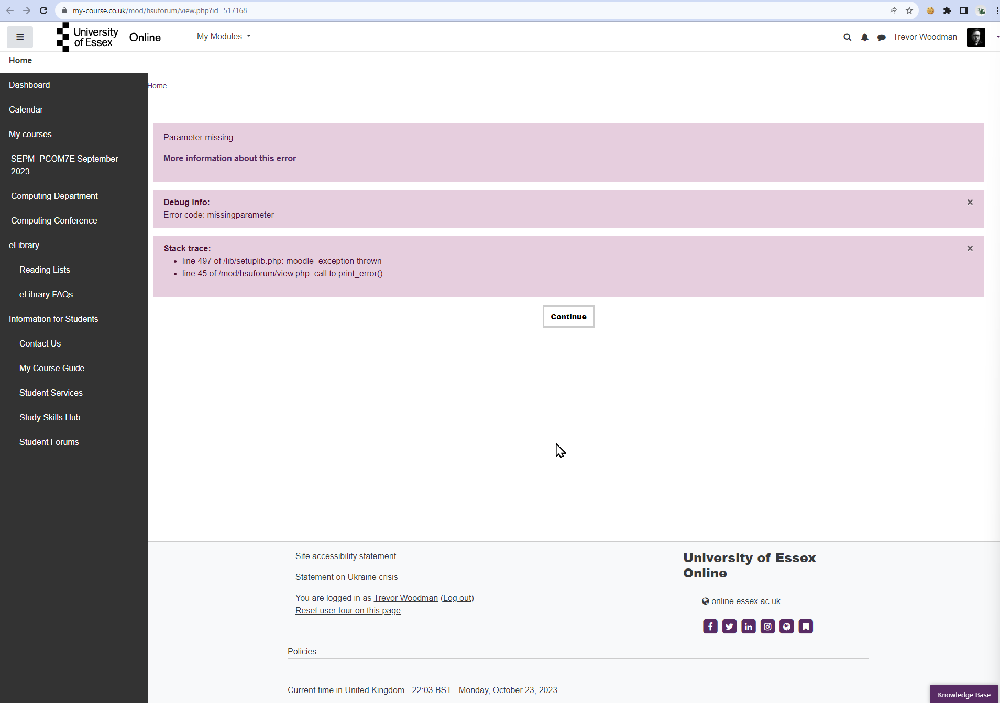

⬅️[Back](/pages/module6.html)

# Unit 4 - Collaborative Discussion Part 1

## Summary Post

*Image Version*

Unfortunately, when I went to post this summary post, I could not as the website kept erroring out. I have included a screenshot of the error:

*Text Version*

In my initial post, I delved into the causes behind project failures, drawing from both research and personal experience. Three significant factors emerged, and I outlined these complex challenges as follows:

1. Bridge Causes: I drew on Lehtinen et al.'s research here, "bridge causes" stood out as the prominent contributor to project failures, accounting for a substantial 50% of all cases. This category encompassed issues like a lack of cooperation, weak task backlog, and insufficient software testing resources (Lehtinen et al., 2014)

2. Task Management Software: Based on my own experience, I highlighted the critical role of robust task management software in the success of a project. A dynamic task board, capable of representing tasks in different formats for different applications (e.g., task view, timelines or Gantt charts, etc.). GitHub Issues, in my opinion, is a prime example of a tool that fits the bill as far as task management software goes.

3. Lack of Cross-Skillset Experience: I emphasized the necessity, especially in software project management, for a project manager to have a generalist mindset and a skillset that encompasses a bit of every team involved. Bridging the divide between software development and executive-level understanding of an issue or feature is essential to the success of a software engineering project.

I particularly enjoyed reading Michael Sammueller's post (Sammueller, 2023), which brought up the concept of the "Swiss Cheese" model from aviation, which models incidents as a series of holes in slices of Swiss cheese, with the holes representing failures in the system (Skybrary, N.D.). The model is a useful way to visualize the causes of project failures and their cascading effects, and I think it is a great way to think about the problem.

**References**

- Lehtinen, T.O.A., et al. (2014) Perceived causes of software project failures - An analysis on their relationships. Available at: https://www.sciencedirect.com/science/article/abs/pii/S0950584914000263 [Accessed October 23, 2023]
- Sammueller, M. (2023) Initial Post. Available at: https://www.my-course.co.uk/mod/forum/discuss.php?d=185542#p304358 [Accessed October 23, 2023]
- SKYbrary (N.D.) James Reason HF Model. Available at: https://skybrary.aero/articles/james-reason-hf-model [Accessed October 23, 2023]
