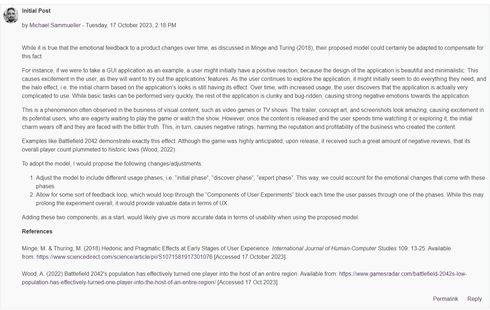
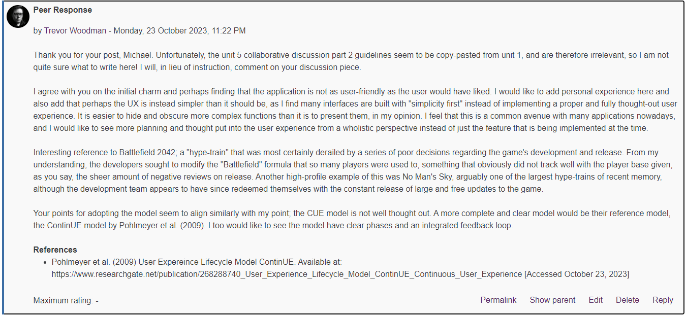

⬅️[Back](/pages/module6.html)

# Unit 5 - Collaborative Discussion Part 2: Factors Affecting User Experience

## Table of Contents
- [Unit 5: Collaborative Discussion Part 2 Description](/pages/module6/unit-assignments/unit5/m6u5-collab-discussion-description.html)
- [Unit 5: Collab - Initial Post](#initial-post)
- [Unit 5: Collab - Peer Response 1](#peer-response-1)

⚠️ Kaplan content errors in this assignment! ⚠️

I would like to point out that as of October 23, 2023, the collab discussion assignment page has various errors, ranging from copy-paste errors to more serious ones:
- The guidance section refers to unit 2 peer responses (this should be unit 5 - the unit description page says the discussion parts will be in units 5, 7, and 8, but there is no collaborative discussion assignments in unit 8!)
- Also asks us to write a "unit 3" summary post (should be unit 7)
- In the line describing peer responses, the actual activity we are to undertake is provided. Unfortunately, this activity is based on the unit 2 peer responses, and has nothing to do with the new collaborative discussion set. "Focus on the possible measures that could have been put in place in order to prevent the incidents highlighted by your peers." - this is entirely irrelevant to the new collaborative discussion set, which is based on a figure that outlines user experience and we are asked if we would modify it in any way; see [collab part 2 description](/pages/module6/unit-assignments/unit5/collab-discussion-description.md) for the assignment page details (as-is, I don't modify these pages when I copy them)

## Initial Post

The figure 1 image in the article 'Hedonic and pragmatic halo effects at early stages of User Experience' by Minge and Thuring (2018) outlines the user experience as a simplified and slightly odd flowchart. Thuring and Mahike's 'CUE' (Components of User Experience) model is not easily followed from a quick glance, unlike the similar model shown as an example in the article, the ContinUE (Continuous User Experience) model (Pohlmeyer et al., 2009).

I would modify the CUE model to be readable to begin with. Compared to the ContinUE model, it is not simple to follow and appears to simply mash together the same concepts in a smaller and less readable format. Presented to clients, I highly suspect most would prefer the ContinUE model, as it is far more readable and clear in its presentation of the user experience lifecycle. Even today, these concepts stand as a clear and concise way to present the UX cycle, showing that UX is more of a social problem than a software problem.

**References**

- Pohlmeyer et al. (2009) User Expereince Lifecycle Model ContinUE. Available at: https://www.researchgate.net/publication/268288740_User_Experience_Lifecycle_Model_ContinUE_Continuous_User_Experience [Accessed October 23, 2023]
- Minge, M. & Thuring, M. (2018) Hedonic and pragmatic halo effects at early stages of User Experience. Available at: https://www.sciencedirect.com/science/article/pii/S1071581917301076?via%3Dihub [Accessed October 23, 2023]

## Peer Response 1

### Peer Post 1 - Michael Sammueller

### My Response (Peer Response 1)

*Image Version*

*Text Version*

Thank you for your post, Michael. Unfortunately, the unit 5 collaborative discussion part 2 guidelines seem to be copy-pasted from unit 1, and are therefore irrelevant, so I am not quite sure what to write here! I will, in lieu of instruction, comment on your discussion piece.

I agree with you on the initial charm and perhaps finding that the application is not as user-friendly as the user would have liked. I would like to add personal experience here and also add that perhaps the UX is instead simpler than it should be, as I find many interfaces are built with "simplicity first" instead of implementing a proper and fully thought-out user experience. It is easier to hide and obscure more complex functions than it is to present them, in my opinion. I feel that this is a common avenue with many applications nowadays, and I would like to see more planning and thought put into the user experience from a wholistic perspective instead of just the feature that is being implemented at the time.

Interesting reference to Battlefield 2042; a "hype-train" that was most certainly derailed by a series of poor decisions regarding the game's development and release. From my understanding, the developers sought to modify the "Battlefield" formula that so many players were used to, something that obviously did not track well with the player base given, as you say, the sheer amount of negative reviews on release. Another high-profile example of this was No Man's Sky, arguably one of the largest hype-trains of recent memory, although the development team appears to have since redeemed themselves with the constant release of large and free updates to the game.

Your points for adopting the model seem to align similarly with my point; the CUE model is not well thought out. A more complete and clear model would be their reference model, the ContinUE model by Pohlmeyer et al. (2009). I too would like to see the model have clear phases and an integrated feedback loop.

**References**

- Pohlmeyer et al. (2009) User Expereince Lifecycle Model ContinUE. Available at: https://www.researchgate.net/publication/268288740_User_Experience_Lifecycle_Model_ContinUE_Continuous_User_Experience [Accessed October 23, 2023]

## Peer Response 2

Unfortunately, as of October 23, 2023, 14:56 UTC-7/22:56 BST, there was only one post to respond to, see [Peer Response 1](#peer-response-1) for my response to the available post.
