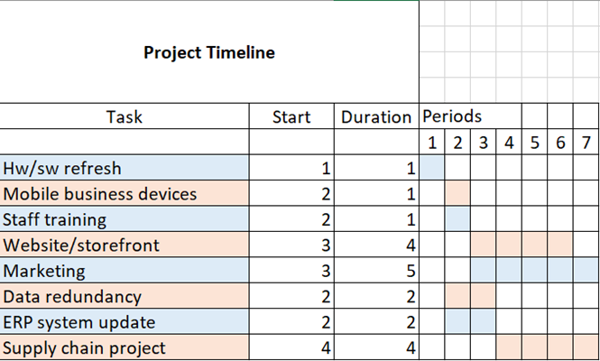

⬅️[Module 7](/pages/module7/assignment1/m7a1.html)

# Assignment 1: Risk Identification Report

This is the HTML version of this assignment. You can also download the [docx version](/assets/module7/assignment1/m7a1.docx).

# Risk Identification Report

ISM_PCOM7E Assignment 1

Trevor Woodman - February 2024

## Introduction
This risk identification report is for Pampered Pets, a brick-and-mortar business that is most known for its locally supplied pet foods. Pampered Pets’ only digitalisation thus far is taking orders via email.

## Scope
Included analyses are relevant IT and personnel assets, threats, and effects for both the current and digitalised state of the business.

## Methodology
The Open Group Risk Analysis (O-RA) quantitative analysis method was used along with the OpenFAIR framework and Open Group Risk Taxonomy (O-RT) standard (The Open Group, 2018, 2020). These were used in this report as they are globally respected open standards. This report does not include full FAIR analyses due to constraints, but FAIR analyses would include detailed breakdowns of loss scenarios, loss event frequency, loss magnitude, primary and secondary loss estimations, models, and executive summary.
 
## Risk Assessment – Current State
### Risk Identification
| Asset | Threat Agent | Threat Event | Effect |
| --- | --- | --- | --- |
| Customer/business information | Criminal, insider | Malicious, error | Confidentiality |
| Customer funds | Criminal, insider, customer | Malicious, error, failure | Loss of funds |
| Employee information | Criminal, insider | Malicious, error | Confidentiality |
| Business devices (networked) | Criminal, insider | Malicious, error | Confidentiality, availability, loss of asset(s), loss of funds |

### Risk Mitigation
- Social engineering, IT security, ICT training for personnel
- Updating/hardening/backup of IT assets and network(s)
- Replace personal with business mobile devices
- Securing of privileged data

## Risk Assessment – Digitalization
### Proposed Changes
- IT hardware/software refresh
- Global website, online storefront and management portal, marketing
- Business data redundancy
- Updated ERP system(s)

### Risk Identification
| Asset | Threat Agent | Threat Event | Effect |
| --- | --- | --- | --- |
| Website/storefront/portal | Criminal, insider | Malicious, error | Confidentiality, availability, loss of funds |
| Updated ERP system(s) | Criminal, insider, customer | Malicious, error, failure | Confidentiality, availability, loss of funds |

### Risk Mitigation
- Industry standard security hardening of website, storefront, management portal, ERP systems, IT devices
- Regular social engineering, IT security, ICT training for personnel

## Business Questions
***Could an online presence grow the business by up to 50%? Could changing to an international supply chain reduce costs by up to 24%?***

According to Parviainen et al., “by digitizing information-intensive processes in a business, costs can be cut by up to 90% and improve turnaround times by several orders of magnitude.” (Parviainen et al., 2016).

***Could the business lose up to 33% of its existing customers if the business doesn’t provide some online features?***

According to the World Economic Forum, retail ecommerce sales grew by 16.5% worldwide in 2020 (Reddy & Morelix, 2020).

## Recommendations

I recommend that the business immediately move towards digitization by refreshing hardware and software, deploying business mobile devices, training staff on ICT and information security, and starting a web storefront project to reach a larger customer base. Expansion of supply chain should be carefully evaluated for quality, availability, and customer satisfaction. As a large draw of the business is that ingredients are locally-sourced, this could prove to lower satisfaction and have negative business impact in the short term. Marketing would extend beyond the release of the storefront for maximum visibility.

## References
- Parviainen, P., et al. (2016) Tackling the digitalization challenge: how to benefit from digitalization in practice. Available at: [https://revistas.uminho.pt/index.php/ijispm/article/view/3856/3909](https://revistas.uminho.pt/index.php/ijispm/article/view/3856/3909) [Accessed 14 February, 2024]
- Reddy, S. & Morelix, A. (2020) Companies now face an urgent choice: go digital, or go bust. Available at: [https://www.weforum.org/agenda/2020/10/digital-transformation-or-bust/](https://www.weforum.org/agenda/2020/10/digital-transformation-or-bust/) [Accessed 14 February, 2024]
- The Open Group. (2021) The Open Group Risk Analysis (O-RA) Standard, Version 2.0.1. Available at: [https://pubs.opengroup.org/security/o-ra/](https://pubs.opengroup.org/security/o-ra/) [Accessed 14 February, 2024]
- The Open Group. (2021) The Open Group Risk Taxonomy (O-RT) Standard, Version 3.0.1. Available at: [https://pubs.opengroup.org/security/o-rt/](https://pubs.opengroup.org/security/o-rt/) [Accessed 14 February, 2024]
- The Open Group. (2018) The Open Group Open FAIR Risk Analysis Process Guide. Available at: [https://pubs.opengroup.org/security/openfair-process-guide/](https://pubs.opengroup.org/security/openfair-process-guide/) [Accessed 14 February, 2024]
